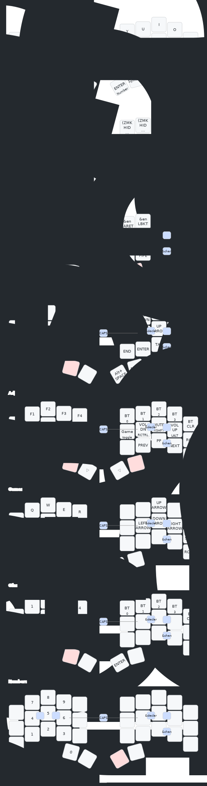

# ferris.zmk

My personal [ZMK](https://zmk.dev/) configuration for the wireless Ferris Sweep split keyboard, used with a dongle.

## Keymap

> [!NOTE]
> `Caps Lock` is used as a [compose key](https://en.wikipedia.org/wiki/Compose_key) for typing non-standard english characters.

